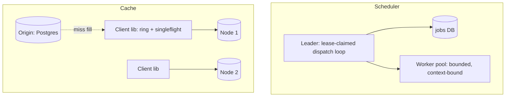

# Job scheduler & distributed cache

## Why Does This Matter?

Paired because both answer the same question with the same tools:
**who owns which piece of shared state, and how does ownership
survive failures?** The scheduler assigns work to workers; the
cache assigns keys to nodes. Both use hashing or leases, both need
rebalancing without thundering herds, and both fail the same way
when ownership is ambiguous ([16 Section 3](../16-distributed-systems/03-leader-election-leases-fencing.md)'s
leases, [16 Section 4](../16-distributed-systems/04-quorums-sharding.md)'s
sharding: the two halves of the answer).

## Requirements

**Scheduler**: recurring + one-off jobs; at-most-once start
per-lease, at-least-once completion; missed jobs run late, never
twice concurrently; p99 dispatch < 1s.

**Cache**: 100M keys, 10:1 read:write, 90% hit rate target;
unbounded-size values rejected at the door; no thundering herd on
hot keys.

## APIs

```text
Scheduler:
POST /jobs            {name, spec(cron|once), payload, lease_ttl}
GET  /jobs/{id}/runs  -> status, attempts, last error

Cache (client library, not HTTP):
Get(key) -> (value, hit)     # singleflight inside
Set(key, value, ttl)
Delete(key)                  # invalidation
```

## Data model

**Scheduler**: jobs table + runs table ([16 Section 3](../16-distributed-systems/03-leader-election-leases-fencing.md)'s
lease claim in SQL):

```sql
CREATE TABLE jobs (
    id uuid PRIMARY KEY, spec text, payload bytea,
    next_run_at timestamptz NOT NULL,
    lease_owner text, lease_until timestamptz
);
-- dispatch = claim with fencing:
UPDATE jobs SET lease_owner=$1, lease_until=now()+$2
 WHERE id IN (SELECT id FROM jobs
              WHERE next_run_at <= now()
                AND (lease_until IS NULL OR lease_until < now())
              LIMIT 100 FOR UPDATE SKIP LOCKED)
 RETURNING id, payload;
```

`SKIP LOCKED` is the whole design in SQL: competing schedulers
claim disjoint batches; the lease + fencing token ([16
Section 3](../16-distributed-systems/03-leader-election-leases-fencing.md)'s
tested coordinator) stops the zombie scheduler from double-running.

**Cache**: consistent hashing ring over nodes ([16 Section 4](../16-distributed-systems/04-quorums-sharding.md)):
key → node with minimal reshuffling on membership change; each key
lives on one primary (+ optional replica). The client library owns
the ring: no central router.

## Architecture



## Scaling & reliability

- **Scheduler**: one active dispatcher via lease (others stand
  by); workers scale independently. Missed schedules degrade to
  "run late": a job that runs twice concurrently is the bug the
  fencing token prevents.
- **Cache**: capacity scales by adding nodes (ring absorbs
  membership); hot keys shard *within* a node via replication, or
  better, the client's singleflight collapses concurrent misses
  ([19 Section 3](../19-performance/03-concurrency-performance.md)'s
  tested pattern) and jittered TTLs prevent synchronized expiry
  ([13 Section 5](../13-databases/05-caching-with-redis.md)).
- **Invalidation** is the cache's hard problem: write-through for
  correctness-critical keys, delete-on-write ([13 Section 5](../13-databases/05-caching-with-redis.md)'s
  rule) for the rest, and versioned keys when stale-serving is
  unacceptable (publish new key, retire old).

## Failure modes

| Failure | Behavior | Mitigation |
|---|---|---|
| Dispatcher crashes mid-batch | Lease expires; another claims; zombie blocked by fencing | [16 Section 3](../16-distributed-systems/03-leader-election-leases-fencing.md)'s coordinator |
| Job crashes the worker | Attempt count + DLQ; poison jobs quarantined | [17 Section 3](../17-messaging/03-portable-patterns.md)'s retry/DLQ shape |
| Cache node dies | Ring redistributes; ~1/N keys cold | consistent hashing; singleflight absorbs the miss wave |
| Hot key stampede | One miss fills; waiters share | singleflight + negative caching |

## Observability & security

Scheduler: `jobs_dispatched_total`, `jobs_overdue`, lease age
histogram; an overdue alert is the "jobs not running" page before
users notice ([20 Section 2](../20-observability/02-metrics.md)). Cache:
hit ratio per node, singleflight wait time, eviction rate.
Security: job payloads are data, not code (no eval; handlers are a
registered, allowlisted set: [21 Section 1](../21-security/01-threat-model-and-validation.md)'s
injection table); cache keys including user input are hashed to
bound cardinality and injection weirdness.

## Go implementation considerations

- **The stage-5 job processor ([08
  Section 5](../08-concurrency/05-patterns.md))** is the worker loop;
  add the SQL lease claim above and the fencing guard ([16
  Section 3](../16-distributed-systems/03-leader-election-leases-fencing.md)'s
  tested `Fenced`) and it becomes distributed.
- **`SKIP LOCKED` via `database/sql`** needs a transaction per
  claim ([13 Section 2](../13-databases/02-transactions-and-isolation.md)'s
  `WithinTx`); the claim's SELECT...FOR UPDATE and the lease
  UPDATE are one statement pair in one tx.
- **The ring**: `hash/crc32` + sorted-node ring is a teaching
  implementation; `groupcache`/`ristretto`-style libraries for
  production; the client-side singleflight from [19
  Section 3](../19-performance/03-concurrency-performance.md) is
  unchanged either way.
- **Clock discipline**: leases compare against the *database's*
  clock where possible (the SQL above) to avoid fleet clock skew
  becoming double-execution ([16 Section 3](../16-distributed-systems/03-leader-election-leases-fencing.md)'s
  TTL-from-measured-pauses rule).
