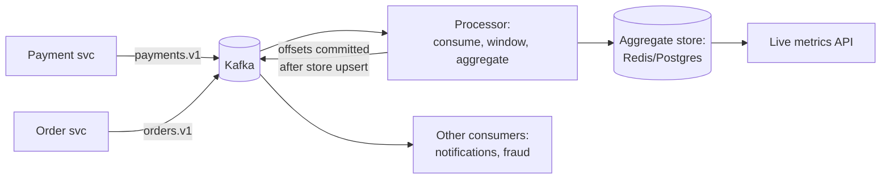

# Event processing & real-time analytics

## Why Does This Matter?

Paired because analytics is the cleanest consumer of the event
backbone: once events flow reliably, "count and aggregate them
live" is the natural second system, and it exercises the hardest
stream semantics (windows, late data, exactly-once *looking*
results). The transport is the Kafka stack ([18](../18-kafka-with-go/01-kafka-concepts.md));
the aggregation layer is where [17](../17-messaging/03-portable-patterns.md)'s
portable patterns meet arithmetic.

## Requirements

**Event backbone**: domain events (orders, payments, clicks) at
50k events/s, keyed by entity, ordered per key, retained 7 days.

**Analytics**: live dashboards (p99 lag < 5s from event to
aggregate), per-key and global windows, late events correct the
aggregate (not silently dropped).

## APIs

```text
Producers (services):  domain events on typed topics, envelope-versioned
                       ([17 §4](../17-messaging/04-schemas-evolution-and-testing.md))

Consumer API (library):
Run(ctx, topic, group, Handler)   # [18 §3](../18-kafka-with-go/03-producer-consumer.md)'s shape
Handler(ctx, Event) error         # retry/DLQ semantics live beneath

Query (read side):
GET /metrics/live/{name}?window=1m -> {value, window_start, lag_ms}
```

## Data model

Events are the source; aggregates are derived and rebuildable:

```text
Topic: payments.v1 (key: charge_id, ordered per charge)
Topic: orders.v1    (key: order_id)

Aggregate store (per window):
  name, window_start, window_end, key?, value
  upserted by the processor; rebuildable from topic replay
```

The retention decision is the durability decision: 7 days of
topics means every aggregate can be rebuilt by replay ([18
§1](../18-kafka-with-go/01-kafka-concepts.md)'s log model): the
processor is stateless-plus-checkpoint, not the source of truth.

## Architecture



- **Ordering**: per-key processing (charge_id) makes per-entity
  windows trivially ordered; global windows accept per-key
  interleaving ([18 §1](../18-kafka-with-go/01-kafka-concepts.md)'s
  partition = ordering promise).
- **Windows**: tumbling windows (fixed, non-overlapping) are the
  default; the processor buckets events by `(window, key)`,
  upserts the aggregate, commits offsets *after* the upsert
  ([18 §3](../18-kafka-with-go/03-producer-consumer.md)'s
  at-least-once with idempotent upserts = effectively-once
  aggregates: the honest phrasing of exactly-once).
- **Late events**: events arriving after the window closed
  upsert a *correction* if within the lateness bound (store keeps
  windows live for N minutes past close); beyond that, the
  reconciler ([25 §3](../25-fintech-with-go/03-integrity-and-exactly-once.md))
  folds them into daily truth. Silent drops are a correctness
  lie.

## Scaling & reliability

- Consumers scale by partitions ([18 §1](../18-kafka-with-go/01-kafka-concepts.md)):
  partition count sets max parallelism; 24 partitions ≈ 24
  effective consumers per topic.
- Processor crash: replay from last committed offsets; idempotent
  upserts make replay harmless ([18 §3](../18-kafka-with-go/03-producer-consumer.md)'s
  offset contract).
- Backpressure: bounded in-flight per consumer; the broker
  buffers ([16 §5](../16-distributed-systems/05-delivery-backpressure-shedding.md)):
  lag is the signal, drops are not the answer. Alert on lag trend,
  not level ([20 §2](../20-observability/02-metrics.md)).

## Failure modes

| Failure | Behavior | Mitigation |
|---|---|---|
| Poison event | DLQ after attempts; window continues | [17 §3](../17-messaging/03-portable-patterns.md) |
| Processor partition stall | Lag grows on one partition; page | per-partition lag alert |
| Schema evolution breaks consumers | Consumers reject loudly; DLQ fills; no silent corruption | [17 §4](../17-messaging/04-schemas-evolution-and-testing.md)'s rules |
| Store unavailable | Offsets uncommitted; replay on recovery | upsert idempotency |

## Observability & security

The four lag signals: consumer lag (per partition), end-to-end
event-to-aggregate latency (the SLO, [20
§4](../20-observability/04-slos-and-alerting.md)), DLQ depth, and
replay age ([18 §4](../18-kafka-with-go/04-observability-tuning.md)'s
metric designs). Security: events carry business data to every
consumer: PII fields minimized at the producer ([21 §5](../21-security/05-secrets-and-supply-chain.md));
the metrics API is authz-gated like any read API ([21
§2](../21-security/02-authentication-and-authorization.md)).

## Go implementation considerations

- **The Kafka service from [18](../18-kafka-with-go/03-producer-consumer.md)**
  (transport-free handler + adapters) is the consumer skeleton;
  the aggregation state (bucket map + flusher) slots into the
  handler with the [17](../17-messaging/README.md) broker's
  semantics as its test double.
- **Window aggregation in Go**: `map[bucketKey]*aggregate` with
  a flush ticker; bounded via the lateness bound ([09
  §5](../09-memory-runtime/05-memory-leaks.md)'s TTL discipline:
  expired buckets freed). The upsert is one Redis
  `INCRBY`/HSET per bucket or one `INSERT ... ON CONFLICT` ([13
  §2](../13-databases/02-transactions-and-isolation.md)).
- **Offset-after-upsert** ordering is the correctness core: the
  commit happens only after the aggregate store accepts the
  batch; a crash replays, the upsert dedupes. Write the test
  ([18](../18-kafka-with-go/README.md)'s skip-if-no-broker tier
  or the in-memory broker).
- **Throughput hygiene**: batch reads (fetch min bytes), batch
  upserts (pipeline), no per-event allocations in the hot loop
  ([19 §2](../19-performance/02-memory-and-allocations.md)'s
  playbook; [09 §2](../09-memory-runtime/02-escape-analysis.md)'s
  audit for the handler).
