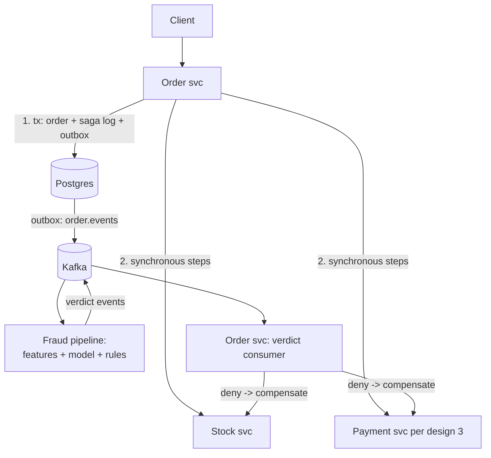

# Fraud detection & order processing

## Why Does This Matter?

Paired because they are two halves of one commerce flow: orders
advance through sagas ([25 Section 3](../25-fintech-with-go/03-integrity-and-exactly-once.md)),
and each step emits the events the fraud pipeline scores ([25
Section 4](../25-fintech-with-go/04-risk-and-compliance.md)). Fraud
cannot block the order path (latency) yet must gate it (risk):
the tension between the two is the design lesson: **the order
system is synchronous and correct; the fraud system is
asynchronous and adaptive; the boundary between them is where
event-driven architecture earns its keep.**

## Requirements

**Orders**: create → reserve stock → charge → fulfill, each step
compensable; idempotent per order; p99 create < 300ms.

**Fraud**: score every order < 2s behind the critical path;
blocklist/velocity/model signals; decisions: approve, review,
deny; deny after approval triggers compensation.

## APIs

```text
Orders:
POST /orders            {customer, items, idempotency_key} -> 201
GET  /orders/{id}       -> status: created|reserved|charged|fulfilled|canceled
POST /orders/{id}/cancel  (compensating action)

Fraud (async consumers + decision API):
GET  /decisions/{order_id}  -> {verdict: approve|review|deny, reasons}
```

## Data model

```text
orders(id, customer, status, idem_key UNIQUE, created_at)
order_items(order_id, sku, qty, price_minor)
saga_steps(order_id, step, state, attempts)   -- the saga log
decisions(order_id, verdict, reasons, scored_at)
```

The saga log is the design: every step's completion is recorded so
compensation knows exactly what to undo ([25 Section 3](../25-fintech-with-go/03-integrity-and-exactly-once.md)'s
orchestrated saga; the outbox publishes step transitions).

## Architecture



- **The synchronous path** (create, reserve, charge) is design 3's
  payment flow extended backward: idempotency keys, ledger writes,
  the PSP discipline. Each step's success is recorded in the saga
  log within its transaction.
- **The asynchronous path**: every state transition hits Kafka;
  the fraud pipeline consumes, scores (features: velocity,
  device, history; rules: hard blocks; model: ML score), and
  publishes verdicts. A deny after "charged" triggers the
  compensation saga (refund + restock): money moved, order dies,
  ledger stays balanced.
- **Review queue**: the "review" verdict parks the order
  human-side; the saga holds at its step with a lease ([16
  Section 3](../16-distributed-systems/03-leader-election-leases-fencing.md)):
  parked work expires into compensation, not into limbo.

## Scaling & reliability

- Orders scale like any transactional service ([13](../13-databases/README.md)):
  the saga log grows with orders; partition by order age for
  archival.
- Fraud scales like a stream consumer (design 6): partitions by
  order_id, stateless scorers, feature store behind a cache ([13
  Section 5](../13-databases/05-caching-with-redis.md)); model inference
  is the expensive dependency: bulkhead it ([15 Section 3](../15-microservices/03-resilience-patterns.md)).
- The deny-after-charge path is the reliability stress: refund is
  another PSP call with its own idempotency; the saga's
  compensation steps are idempotent by construction ([25 Section 3](../25-fintech-with-go/03-integrity-and-exactly-once.md)):
  replayed compensations are no-ops.

## Failure modes

| Failure | Behavior | Mitigation |
|---|---|---|
| Fraud pipeline down | Orders proceed; review queue absorbs; rules mode (hard blocks only) | degradation class ([22 Section 4](../22-production-go/04-dependency-failures.md)) |
| Compensation fails (refund rejects) | Retry with backoff; dead-letter after N; human queue | DLQ + reconciliation ([25 Section 3](../25-fintech-with-go/03-integrity-and-exactly-once.md)) |
| Duplicate order events | Fraud consumers dedupe by event ID | [17 Section 3](../17-messaging/03-portable-patterns.md) |
| Stock double-reserved under retries | Reserve is idempotent by (order, sku) | [25 Section 1](../25-fintech-with-go/01-money-and-payments.md)'s key discipline |

## Observability & security

Metrics: `orders_total{status}` (the funnel),
`saga_compensations_total{reason}`, fraud `verdicts_total{verdict}`,
model latency ([20 Section 2](../20-observability/02-metrics.md)). The
fraud SLO is lag-based (event-to-verdict p99 < 2s); the order SLO
is availability ([20 Section 4](../20-observability/04-slos-and-alerting.md)).
Security: fraud signals are attack surface in reverse: adversaries
probe the rules; the feature store and model versions are audit
logged ([25 Section 4](../25-fintech-with-go/04-risk-and-compliance.md)'s
regulatory honesty); decisions are explainable (reasons persisted)
because "the model said no" does not survive a chargeback dispute.

## Go implementation considerations

- **The saga/orchestrator pattern from [25 Section 3](../25-fintech-with-go/03-integrity-and-exactly-once.md)**
  is the order engine; its step table + state machine maps
  directly to the saga log above.
- **Verdict consumption** uses [18](../18-kafka-with-go/03-producer-consumer.md)'s
  service shape: transport-free handler, idempotent by event ID,
  offsets after effects.
- **Feature computation** is the stream aggregation from design 6
  (velocity = windowed count per customer/card); the same
  bounded-bucket code with TTLs ([09 Section 5](../09-memory-runtime/05-memory-leaks.md)).
- **Hard blocks are cheap and synchronous**: the rules tier (card
  country, known-bad lists) runs inline in the order path ([21
  Section 4](../21-security/04-limits-and-hardening.md)'s limits as
  security controls); the model tier stays async. The split keeps
  p99 create at 300ms while fraud still gates the flow.
- **Compensation tests are the heart**: the parity harness pattern
  ([25 Section 2](../25-fintech-with-go/02-double-entry-ledger.md)) plus
  scenarios: deny-before-charge (no compensation), deny-after
  (refund + restock), compensation-crash (replay completes it).
