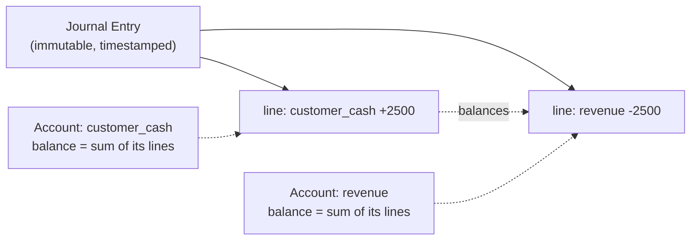

# Double-entry ledgers

## Why Does This Matter?

Every financial system answers one question constantly: *where is the
money?* Answers assembled from mutable balances ("update the user's
balance row") rot — they cannot explain their own history, survive
concurrency, or satisfy auditors. Double-entry bookkeeping is the
500-year-old answer: every movement of value is recorded as balanced
entries, so the *ledger itself* is the source of truth, and balances are
derived views. This chapter builds one in Go, with the invariants that
make it trustworthy enforced by tests.

## Mental Model

A **journal entry** records one business event as a set of **lines**.
Each line debits one account and credits another — every line has two
sides, and the sides sum to zero:

```text
Customer pays 25.00 USD for an order:

  line 1:  +2500  customer_cash      (debit  — money in)
  line 2:  -2500  revenue            (credit — value out)

  sum: 0 ✓
```



The invariants — the entire safety story:

1. **Every entry sums to zero.** Money appears from nowhere and
   vanishes to nowhere, ever.
2. **Entries are immutable.** Mistakes are corrected by *new* reversing
   entries, never edits. The ledger is the audit trail.
3. **Accounts are derived.** Balance(account) = sum of its lines.
   Recomputable from entries alone — that is what makes reconciliation
   possible.
4. **Per-account ordering.** An account's lines apply in a total order
   (entry sequence); concurrent postings to one account serialize.

## The Go implementation

```go
// examples/ledger/ledger.go (core excerpt; full file in examples/)
package ledger

import (
	"context"
	"fmt"
	"sync"
	"time"
)

// AccountID names a ledger account ("customer_cash", "revenue", ...).
type AccountID string

// Line is one side of an entry: a signed amount against one account.
type Line struct {
	Account AccountID
	Amount  Money // signed: positive = debit, negative = credit
}

// Entry is one immutable journal entry: balanced lines, timestamp,
// reference to the business event that caused it.
type Entry struct {
	ID        int64
	PostedAt  time.Time
	Reference string // e.g. "payment:k1", "order:o42" — the audit hook
	Lines     []Line
}

// Journal stores entries. The educational version is in-memory with
// mutex-protected sequence allocation; production backs this with a
// single-transaction database insert (see ch. 03 for the DB contract).
type Journal struct {
	mu       sync.Mutex
	entries  []Entry
	nextID   int64
	byAccount map[AccountID][]int64 // derived index, rebuilt on demand
}

// Post validates and appends an entry atomically. It is the ONLY way
// money moves. Immutability follows: nothing mutates entries after Post.
func (j *Journal) Post(_ context.Context, ref string, lines []Line) (Entry, error) {
	if len(lines) < 2 {
		return Entry{}, fmt.Errorf("entry %q: %w", ref, ErrUnbalanced)
	}

	// Invariant 1: the entry sums to zero, and every currency agrees.
	var total Money
	for i, l := range lines {
		if i == 0 {
			total = l.Amount
			continue
		}
		sum, err := total.Add(l.Amount)
		if err != nil {
			return Entry{}, fmt.Errorf("entry %q line %d: %w", ref, i, err)
		}
		total = sum
	}
	if !total.IsZero() {
		return Entry{}, fmt.Errorf("entry %q: %w (sums to %s)", ref, ErrUnbalanced, total)
	}

	j.mu.Lock()
	defer j.mu.Unlock()
	j.nextID++
	e := Entry{
		ID:        j.nextID,
		PostedAt:  time.Now().UTC(),
		Reference: ref,
		Lines:     append([]Line(nil), lines...), // defensive copy: entries are immutable
	}
	j.entries = append(j.entries, e)
	return e, nil
}
```

### Derived balances

```go
// Balance returns the account balance by summing its lines in entry
// order. Derived, never stored — the ledger is the source of truth.
func (j *Journal) Balance(_ context.Context, a AccountID) (Money, error) {
	j.mu.Lock()
	defer j.mu.Unlock()

	var bal Money
	first := true
	for _, e := range j.entries {
		for _, l := range e.Lines {
			if l.Account != a {
				continue
			}
			if first {
				bal = l.Amount
				first = false
				continue
			}
			sum, err := bal.Add(l.Amount)
			if err != nil {
				return Money{}, fmt.Errorf("balance %s: %w", a, err)
			}
			bal = sum
		}
	}
	if first {
		return Money{}, ErrUnknownAccount
	}
	return bal, nil
}
```

Real ledgers keep this fast with per-account running balances maintained
*in the same transaction* as the posting, periodically re-derived from
entries to prove the derivation hasn't drifted — that re-derivation is
reconciliation (ch. 03).

## The tests that make it trustworthy

The invariants are load-bearing, so they are tested like it — including
the concurrency shape:

```go
// ledger_test.go (excerpt)
func TestPost_RejectsUnbalanced(t *testing.T) {
	j := NewJournal()
	_, err := j.Post(ctx, "bad", []Line{
		{Account: "a", Amount: mustMoney(t, 100, "USD")},
		// missing the balancing -100 side
	})
	if !errors.Is(err, ErrUnbalanced) {
		t.Fatalf("err = %v, want ErrUnbalanced", err)
	}
}

func TestConcurrentPosts_StayBalanced(t *testing.T) {
	j := NewJournal()
	var wg sync.WaitGroup
	for i := 0; i < 100; i++ {
		wg.Go(func() {
			_, _ = j.Post(ctx, fmt.Sprintf("tx-%d", i), []Line{
				{Account: "customer_cash", Amount: mustMoney(t, 1, "USD")},
				{Account: "revenue", Amount: mustMoney(t, -1, "USD")},
			})
		})
	}
	wg.Wait()

	cash := mustBalance(t, j, "customer_cash")
	rev := mustBalance(t, j, "revenue")
	if cash.Amount() != 100 || rev.Amount() != -100 {
		t.Errorf("post-race lost money: cash=%s revenue=%s", cash, rev)
	}
	// Run with -race: the mutex discipline is part of the contract.
}
```

## Production notes — where the toy ends

The educational journal is in-memory; the production contract differs
in exactly three places, and it is worth stating them because they are
the whole engineering gap:

1. **Durability**: entries go to a database in one transaction — the
   entry INSERT and any balance-cache update commit together (ch. 03's
   transaction boundary discussion).
2. **Ordering**: the entry sequence comes from a DB sequence; per-
   account serialization uses row locks or per-account writer lanes.
3. **Immutability**: enforced by permissions and append-only design,
   not just by Go's unexported fields. Audit access is its own role.

Everything else — balanced lines, immutable entries, derived balances,
reversal entries for corrections — transfers directly.

## Common Mistakes

- **Storing balances without entries** — the balance row is a cache; if
  it is the only representation, history and reconciliation are gone.
- **Editing entries** (or allowing "delete + repost") — the audit trail
  dies; corrections are reversing entries.
- **Multi-currency entries summed carelessly** — the journal's Add
  chain rejects mixed currencies at line 2, which is the test that
  saves you.
- **Entries with one line** — "external" sides (fees, settlements,
  PSPs) are accounts too; model the counterparty, don't special-case.
- **Non-atomic posting** — writing line 1 and line 2 in separate
  transactions can store an unbalanced world state; the entry is the
  transaction unit.

## Idiomatic Go

- `Journal.Post` takes `[]Line` and copies defensively — ownership
  boundaries are explicit (see the concurrency chapters).
- Errors carry the entry reference: `entry "payment:k1": unbalanced
  (sums to 12 USD)` — incidents get named evidence for free.
- The journal exposes `Post` and queries; nothing else. The narrow API
  is what makes the immutability claim believable.

## Performance Considerations

- The naive Balance is O(entries); production keeps per-account running
  totals updated transactionally and re-derives on a schedule.
- Posting hot paths are DB-bound; batch independent postings and shard
  by account for write throughput ([19-performance](../19-performance/)
  discipline applies verbatim).
- Integer money means arithmetic never appears in profiles — if it
  does, something is converting to float or big.Int on the hot path.

## Concurrency Considerations

- `sync.Mutex` per journal serializes postings — correct and slow;
  production replaces it with DB transaction semantics, where the
  invariant enforcement (sum-to-zero CHECK, per-account locks) lives in
  the schema.
- The concurrent-posts test under `-race` is the shape every ledger PR
  should include: the invariant must hold under interleaving, not just
  sequentially.

## Security Considerations

- Post authority is an authorization decision: who may post to which
  accounts is business policy, enforced at the service boundary
  ([21-security](../21-security/)).
- References ("payment:k1") must not leak PII into ledger identifiers;
  use opaque IDs with a separate mapping.
- Ledger data at rest: encrypted, access-logged, retention per
  regulation (ch. 04).

## Testing Strategy

- Invariant tests first: unbalanced rejection, mixed-currency
  rejection, immutability (post-then-observe twice), zero-entry
  handling.
- Property tests: N random balanced postings → total across all
  accounts is zero, per-account balances equal the sum of their lines.
- Concurrency: parallel postings under `-race`; parallel
  Balance-during-Post reads see a consistent prefix.
- Replay test: serialize entries, rebuild balances in a fresh journal,
  compare — the reconciliation smoke test.

## Interview Questions

1. *Why double-entry instead of balance rows?* — History, invariants,
   reconciliation, audit; the candidate who says "balances are derived
   views" is the one who has built it.
2. *How do you correct a mis-posted entry in production?* — Reversing
   entry pairs; never edit; the audit trail stays append-only.
3. *Design the DB schema for this journal.* — entries + lines tables,
   sum-to-zero enforced per entry (trigger or app-level in-tx check),
   per-account ordering, reference linking; the follow-up is isolation
   level and why.
4. *Where does double-entry break down?* — Legitimately tricky corners:
   FX (multi-currency entries need per-currency balance rules), custody
   movements, off-ledger state machines — the honest "it's still the
   right foundation, with extra rules" answer.

## Practice Exercises

1. Add `PostMultiCurrency` supporting entries with multiple currencies
   where each currency's lines sum to zero independently; extend the
   invariant tests.
2. Implement `EntriesFor(reference string) []Entry` and a rebuild test
   that reconstructs a fresh journal from serialized entries and
   compares balances exactly.
3. Benchmark Post on your machine; then batch 100 postings per
   transaction (fake DB layer) and measure the amortization — the
   number justifies ch. 03's batching advice.

## Further Reading

- [Stripe: how we built it — design of financial ledgers](https://stripe.com/blog/ledger) — a production ledger's design notes
- [Double-entry bookkeeping](https://en.wikipedia.org/wiki/Double-entry_bookkeeping) — the 500-year-old model, for vocabulary
- *Designing Data-Intensive Applications*, ch. 7 (Transactions) — Kleppmann; the isolation-level context for posting
