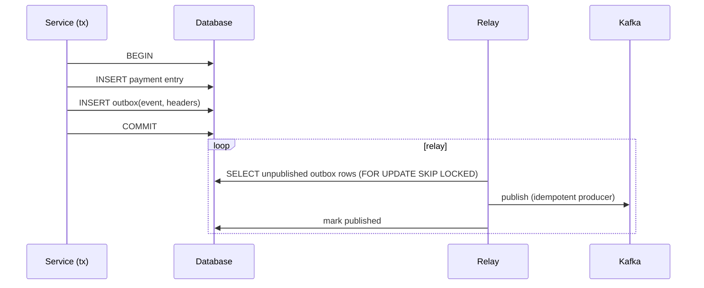

# Integrity, consistency & exactly-once myths

## Why Does This Matter?

Distributed financial systems fail in a specific, well-documented way:
component A saw success, component B never heard, and money exists in
two places or none. Engineers who do not internalize *why* exactly-once
is not a transport property keep rediscovering double-charge incidents.
This chapter is the integrity manual: distributed transactions, the
outbox pattern, delivery semantics you can defend, and the
reconciliation discipline that catches what invariants miss.

## Mental Model

```text
Perfect delivery (exactly-once, everywhere)  ←  does not exist as a property
                                               of any network or broker
─────────────────────────────────────────────
What exists:
  at-least-once  +  idempotent effects      =  effectively-once  ← build this
  durable outbox + relay                    =  no lost events   ← build this
  reconciliation                            =  truth about drift ← run this
```

Every rule in this chapter is one of those three constructions.

## Exactly-once: the honest teardown

Claims decompose like this:

| Layer claims exactly-once | What it actually guarantees |
|---|---|
| Kafka transactions (EOS) | atomic produce across topics + consume offsets, for consumers reading committed data: within the Kafka boundary only |
| Idempotent producer | no broker-side duplicates from client retries: again, one boundary |
| "Our HTTP API is idempotent" | replays of the *same request* collapse: your *workflows* still span many calls |
| DB transactions | atomicity within one database: no statement about the network outside |

End-to-end exactly-once requires the *effect* (money moved, order
recorded) to be deduplicated at its destination: that is idempotent
consumers + idempotency claims (ch. 01), not a checkbox on a broker.
The production default: **at-least-once delivery + idempotent
processing + reconciliation**. Say it exactly that way in design docs.

## Distributed transactions: the options, honestly ranked

1. **Single DB transaction** (when both sides live in one database):
   the claim INSERT and the entry INSERT commit together. This is why
   the ledger and its claims share a schema in ch. 01's design.
2. **Outbox pattern** (when events must reach other systems):
   the state change and the event are written in the SAME database
   transaction; a relay publishes afterwards. Solves the dual-write
   problem (wrote DB, crashed before publishing → lost event; wrote
   broker, DB rolled back → phantom event).
3. **Saga** (multi-service business flows): sequence local transactions
   with compensating actions for rollback. Payment → inventory →
   shipping, each with an explicit compensation. No distributed lock,
   no two-phase commit.
4. **Two-phase commit / XA**: correctness by coordination; cost is
   availability (coordinator is a single point) and latency. Rarely the
   right call in modern payment stacks; know it for interviews, prefer
   sagas for real flows.

### The outbox pattern concretely



The relay is at-least-once (it may republish after a crash between
publish and mark), so *consumers are idempotent*, and the outbox rows
carry the same idempotency keys the API did. One key namespace from
HTTP request through Kafka through the ledger claim: that thread is
what makes the system debuggable.

Go sketch of the relay loop:

```go
// Educational relay: poll, publish, mark. SKIP LOCKED lets many relays
// run safely; production tunes batch size and backoff per load.
func (r *Relay) Run(ctx context.Context) {
	for {
		rows, err := r.db.QueryContext(ctx, `
			SELECT id, payload FROM outbox
			WHERE published_at IS NULL
			ORDER BY id
			LIMIT 100
			FOR UPDATE SKIP LOCKED`)
		if err != nil { r.log.Error("outbox poll", "err", err); sleepBackoff(); continue }

		for rows.Next() {
			var id int64; var payload []byte
			_ = rows.Scan(&id, &payload)
			if err := r.publish(ctx, id, payload); err != nil { continue } // retry next round
			r.markPublished(ctx, id)
		}
		rows.Close()
	}
}
```

## Reconciliation: the discipline that closes the loop

Invariants prevent drift; reconciliation *finds* it anyway. The
standard flows:

1. **Internal**: derived balances vs re-computed from entries (the
   ledger's replay test, run against production data on a schedule).
2. **External**: your ledger vs the PSP's settlement report,
   every auth, capture, refund, and fee matched line by line. Mismatches
   become investigate items with SLAs; unmatched PSP records are money
   you don't know about.
3. **Claim closure**: claims pending longer than T are queried against
   the PSP (the timeout workflow from ch. 01) and resolved.

```go
// Educational: the reconciliation query shape. The report comparison
// is a join on idempotency keys with a diff walk; the invariant is
// "every PSP line has exactly one ledger entry and vice versa."
func (r *Reconciler) DailySettlement(ctx context.Context, report []PSPLine) (*Report, error) {
	rep := &Report{}
	for _, line := range report {
		match, err := r.ledger.FindByAuth(ctx, line.AuthID)
		if errors.Is(err, ErrNotFound) {
			rep.UnmatchedPSP = append(rep.UnmatchedPSP, line) // PSP moved money, ledger didn't
			continue
		}
		if err != nil {
			return nil, err
		}
		if match.Amount != line.Amount {
			rep.Mismatched = append(rep.Mismatched, Pair{match, line}) // amounts disagree
		}
	}
	// ...and the reverse direction: ledger entries with no PSP line.
	return rep, nil
}
```

Reconciliation output is an operations surface with alerting (any
non-empty mismatch report pages someone: see
[20-observability](../20-observability/)), not a nightly log nobody
reads.

## Audit logs

Distinct from application logs: append-only, structured records of
*who did what to which money*, with actor identity, before/after, and
correlation IDs end to end. Requirements: tamper-evidence (hash chains
or WORM storage for regulated environments), access control separate
from business data access, retention per regulation. In Go terms:
audit writes go through the same transactional boundary as the money
movement: an audit trail written after the fact is a nice-to-have,
not an audit trail.

## Common Mistakes

- **Dual writes** (DB write + broker publish as two steps): the outbox
  exists because this fails predictably; audit every `db.Write(); 
  kafka.Send()` pair in your codebase.
- **Compensation as undo**: sagas compensate business-wise (refund,
  not "un-post"), because some effects cannot undo; design
  compensations that are themselves idempotent and auditable.
- **Retrying unknown outcomes**: ch. 01's cardinal rule; this chapter
  adds: the *resolution* (reconciliation query) is also a workflow with
  its own idempotency.
- **Reconciliation as a report nobody owns**: unmatched items need
  assignees and SLAs; unowned reports rot into normalcy.
- **Believing "we use Kafka transactions so we're exactly-once"**,
  re-read the teardown table; the boundary is the point.

## Idiomatic Go

- One idempotency-key namespace per business operation, threaded from
  HTTP header through outbox row through Kafka header through ledger
  claim: a single string field, documented in the envelope (18's
  envelope pattern).
- The relay and reconciler are long-running loops with ctx, bounded
  batches, and structured logging: the stage-5 processor shape again.
- Reconciliation results are plain structs with diff semantics: test
  them like the ledger (property tests over injected drift).

## Performance Considerations

- Outbox relays batch (LIMIT 100 above) and SKIP LOCKED parallelizes
  safely; throughput scales with relay count until the DB is the
  ceiling.
- Reconciliation is a batch workload: run it off-peak, index on
  idempotency/auth IDs, and stream large reports rather than loading
  them.
- The double-entry posting path remains the latency-critical one,
  ch. 02's notes hold.

## Concurrency Considerations

- Outbox relays racing: SKIP LOCKED (or per-relay ID sharding) prevents
  duplicate publish storms; duplicates are tolerated by idempotent
  consumers regardless: defense in depth, both layers.
- Claim store contention on hot keys (payment retries hammering the
  same key) is a per-key serialization point; bound with per-key rate
  limits ([21-security](../21-security/)).

## Security Considerations

- Outbox rows and DLQ topics contain full business payloads: apply the
  same retention/encryption as the source of truth, and keep PII out of
  keys and references.
- Reconciliation reports are risk-sensitive documents (they reveal
  drift); access-controlled, and their publication is logged.

## Testing Strategy

- Fault-injection tests: kill between DB commit and publish (the dual-
  write failure) and assert the relay recovers exactly the event.
- Property test: any interleaving of relay crashes leaves the event
  eventually published exactly-once-effectively (idempotent consumer
  asserts single apply).
- Reconciliation tests: inject every drift class (extra PSP line,
  missing PSP line, amount mismatch) and assert the report classifies
  each.
- Chaos tier: consumer SIGKILL mid-batch (18's broker tests) with
  ledger assertions on double-apply absence.

## Interview Questions

1. *Is exactly-once possible? Defend your answer at three layers.*,
   The teardown table; grade on boundary-awareness.
2. *Design "payment accepted, then the event must reach 3 downstream
   systems reliably."*: Outbox + relay + idempotent consumers; the
   follow-up "what if the relay dies mid-publish" separates the
   memorized from the understood.
3. *Walk me through your first day after a PSP settlement mismatch.*
  : Reconciliation flow, evidence, ownership, SLA; grade on treating
   it as operations, not archaeology.
4. *Saga vs 2PC for a payment + inventory + shipping flow: decide and
   justify.*: Saga for availability and auditability; compensation
   design; the 2PC discussion shows you know what you rejected.

## Practice Exercises

1. Build the outbox relay against SQLite (single-file, transactional)
   with a fake broker; kill -9 the relay between publish and mark;
   prove consumers still apply exactly once.
2. Extend the ledger example with a `ReversalEntry` constructor
   (post a balanced inverse) and a test that an original + reversal
   leaves all balances unchanged.
3. Write the reconciliation daily job for the ledger vs a fake PSP
   report; inject three drift types and assert each lands in the right
   bucket with the right alert.

## Further Reading

- [Stripe: idempotency keys](https://docs.stripe.com/api/idempotent_requests): the workflow contract, again
- [Microservices.io: transactional outbox](https://microservices.io/patterns/data/transactional-outbox.html): the pattern reference
- [Kafka: exactly-once semantics](https://www.confluent.io/blog/exactly-once-semantics-are-possible-heres-how-apache-kafka-does-it/): what EOS does and does not cover, from the implementers
- [Designing Data-Intensive Applications](https://dataintensive.net/): ch. 7 and 9 for transactions and consistency
