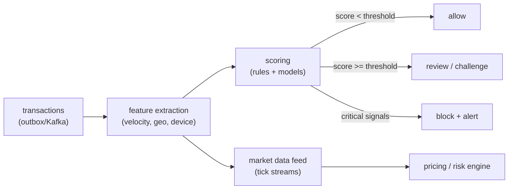

# Risk, market data & compliance

## Why Does This Matter?

Ledgers move money; risk systems decide *whether* money should move,
and compliance makes the whole thing defensible. These are event-driven
pipelines under latency pressure with regulatory weight behind them —
a distinctive Go engineering profile: high-throughput streams, scoring
pipelines, and immutable evidence.

## Mental Model



Risk is a pipeline: features → score → decision, with every step
event-sourced so decisions are explainable after the fact. That last
clause is the regulatory one: *why did you block this payment?* must be
answerable from stored evidence, months later.

## Fraud & risk pipelines in Go

### The event-driven shape

Risk consumes the same events the ledger produces (outbox → Kafka —
ch. 03's machinery reused), extracts features per entity, and scores.
The Go implementation profile:

```go
// Educational: the scoring contract. Rules are pure functions over
// features; models load once; decisions record their inputs.
type Features struct {
	AccountID     string
	AmountMinor   int64
	Currency      string
	TxnLastHour   int     // velocity: count of prior txns
	AmountAvg30d  int64   // behavioral baseline
	NewDevice     bool
	GeoDistanceKm float64 // distance from usual location
}

type Decision struct {
	Score     float64
	Outcome   Outcome // Allow / Review / Block
	Reasons   []string // human-readable, evidence-linked
	FeatureRef string // pointer into the feature store for audit
}

// Score is pure: same features in, same decision out. Purity is what
// makes the audit replay (below) possible.
type Score func(f Features) Decision

// RulesEngine chains rules; first blocking verdict wins, all reasons
// accumulate for review queues.
type RulesEngine struct {
	rules []struct {
		name  string
		apply Score
	}
}

func (e *RulesEngine) Evaluate(f Features) Decision {
	dec := Decision{Outcome: Allow}
	for _, r := range e.rules {
		d := r.apply(f)
		dec.Score += d.Score
		dec.Reasons = append(dec.Reasons, d.Reasons...)
		if d.Outcome == Block && dec.Outcome != Block {
			dec.Outcome = Block
		}
	}
	return dec
}
```

Design notes that matter operationally:

- **Purity for decisions** — a decision is a function of features; when
  a regulator or customer asks "why," you re-run the stored features
  through the (versioned) rules and reproduce the verdict. Store: the
  features snapshot, the rule version, the decision.
- **Velocity features need windows** — "5 transactions in the last
  hour" is a sliding-window count over the event stream; Go implements
  it with per-account tumbling/sliding state (bounded maps + eviction —
  the [03-data-structures](../03-data-structures/) LRU shape) or a
  dedicated feature store.
- **Latency tiers**: rules run inline (milliseconds, blocks the
  payment); heavy models run async and adjust *future* decisions. The
  payment path never waits on a model server — degradation is "decide
  with rules," not "fail open" or "fail closed" by accident.

### Market data — the low-latency profile

Tick streams (price updates) at tens of thousands per second shape Go
differently than CRUD:

- **Decoding is the hot path** — binary protocols (FIX/ITCH-like) with
  hand-rolled parsers, fuzzed hard ([21-security](../21-security/)
  treats decoders as trust boundaries).
- **Allocation discipline** — per-tick structs pooled, slices
  preallocated ([19-performance](../19-performance/) ch. 02 applies
  verbatim; the "measure first" rule too — plenty of "low-latency"
  workloads are actually I/O-bound).
- **Ordering per instrument** — ticks for one symbol order within a
  Kafka partition keyed by symbol (18's keying rules, reused); fan-out
  to subscribers via the pipeline patterns.
- **The last price is a cache, not a database** — atomic pointer swap
  per symbol beats locks on the hot read path.

## Event-driven finance

The pattern vocabulary assembles from this handbook: events are the
ledger's outbox (ch. 03), transport is Kafka (ch. 18), consumers are
idempotent with claims (ch. 01/18), and projections build read models
(balances, statements, risk features) from the event stream. The
finance-specific rule: **projections are rebuildable**. If a projection
cannot be rebuilt from events, it is a second source of truth, and you
have two ledgers — the reconciliation chapter's nightmare.

## Regulatory considerations — the honest version

This handbook is not legal advice; these are the engineering behaviors
regulation drives:

| Driver | Engineering consequence |
|---|---|
| PCI DSS (card data) | card numbers never in your systems/logs; tokenization at the PSP; scope reduction as an architecture goal |
| AML/KYC | identity checks as explicit workflow states; sanctions screening as a blocking gate with audit trail |
| Retention rules | ledger + audit logs retained per jurisdiction (often 5-10y); append-only storage enforced technically |
| Right-to-explanation (fair lending/fraud) | decisions explainable and reproducible from stored features + versioned rules |
| Data residency | event pipelines and stores pinned per jurisdiction; partition/region keys in the architecture from day one |

Engineering posture: compliance requirements arrive as *features* with
deadlines. Design the evidence trails (immutable events, versioned
rules, auditable decisions) early — retrofitting evidence is the
expensive path.

## Data security in fintech (condensed pointers)

The [21-security](../21-security/) patterns apply, with finance-specific
sharpening: secrets in a manager with rotation ([21](../21-security/)),
PII/PCI field-level classification (never log a PAN — the token is the
identifier), mTLS between services handling money flows, and the
principle that ledger access is its own authorization domain (ch. 02).
Fuzz every decoder; race-detect every ledger path.

## Common Mistakes

- **Fail-open risk checks under load** — "if the rules engine is down,
  allow" must be a *documented, risk-signed* decision, not an error
  path someone wrote; the default fail state is a business decision
  with an owner.
- **Models inline on the payment path** — a 200ms model call turns p99
  payment latency into an SLA breach; async scoring adjusts behavior,
  inline rules decide.
- **Unversioned rules/models** — you cannot reproduce last quarter's
  decision with today's rules; version everything that decides.
- **PII/PAN in logs and event payloads** — the audit trail becomes the
  breach surface; tokenize at the boundary, scrub at the logger.
- **Treating compliance as a checkbox after launch** — the evidence
  architecture (above) is the design; retrofits cost more than the
  original build.

## Idiomatic Go

- Rules as pure functions, engines as data: versionable, testable,
  explainable — tables over cleverness.
- Feature stores and projections behind the same narrow interfaces as
  repositories ([14-backend-development](../14-backend-development/)).
- Decisions, features, and rule versions are structs with JSON tags —
  the audit record format *is* the struct, diffable in reviews.

## Performance Considerations

- Risk pipelines scale horizontally by entity sharding (account →
  partition, 18's keying); velocity windows are per-shard state.
- Market data hot paths: allocation-free decoding, pooling, PGO —
  measured with the [19-performance](../19-performance/) discipline.
- Compliance storage (immutable audit) grows monotonically: lifecycle
  policies and compression belong in the design, not the ops backlog.

## Concurrency Considerations

- Per-account serial processing preserves feature consistency (the
  ledger's per-account ordering rule, reused); global scoring fan-in
  needs no ordering (scores are stateless per request).
- Rules engines are read-mostly: load versions at startup, swap
  atomically (atomic pointer to an immutable ruleset) — no locks on
  the scoring path.

## Security Considerations

- The scoring pipeline is a decision system: protect its inputs
  (features) from manipulation as rigorously as its outputs — a
  poisoned feature store is a fraud vector aimed at yourself.
- Audit stores get the tightest access controls in the system: read
  access is privileged, write access is system-only (append-only).

## Testing Strategy

- Decision tests: feature snapshot in → exact decision out, per rule
  version (golden tests; the rules are a spec).
- Property tests: allow/block thresholds are monotone in score;
  reasons are never empty for Block.
- Replay tests: stored features + versioned rules reproduce stored
  decisions — the audit capability, tested like an invariant.
- Load tests: velocity windows under burst (the bounded-state
  discipline from [08-concurrency](../08-concurrency/)).

## Interview Questions

1. *Design a fraud-detection pipeline for 10k TPS.* — Event ingestion
   (outbox/Kafka), per-account sharding, inline rules + async models,
   decision audit; grade on the latency-tier separation.
2. *A regulator asks why you blocked a payment from 6 months ago.*
   — Stored features + rule version + replay; the answer that says
   "we log the decision" without the *inputs* is incomplete.
3. *Market data at 50k ticks/s in Go — where does it get hard?*
   — Decoding, allocations, per-symbol ordering; the candidate who
   asks about the actual consumer's latency budget before optimizing
   shows the measurement discipline.
4. *How does PCI DSS change your architecture?* — Scope reduction via
   tokenization; the engineering answer (never store PAN, minimize
   scope) vs the compliance-answer (a binder).

## Practice Exercises

1. Implement velocity features (sliding window per account) with
   bounded memory; test under burst and prove eviction.
2. Build the decision-audit replay: persist features + rule version +
   decision; re-run and compare — then change the ruleset and verify
   the old version still reproduces the old decision.
3. Load-test the rules engine at 10k decisions/s; profile it and write
   down whether the hot path is your code or JSON — then fix the JSON.

## Further Reading

- [Stripe: radar and fraud](https://stripe.com/radar) — production fraud-system framing (product docs, not internals)
- [FIX protocol](https://www.fixtrading.org/standards/) — the market-ecosystem protocol family
- [Kafka: event streaming in finance](https://www.confluent.io/resources/) — Confluent's finance reference architectures
- [PCI Security Standards Council](https://www.pcisecuritystandards.org/) — the primary source for PCI DSS
