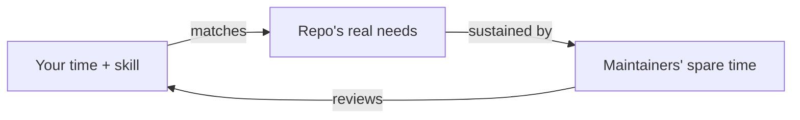

# Finding the right repository & first issue

## Why Does This Matter?

Most failed open-source attempts die before any code is written: the
contributor picks a repository that cannot accept their work (frozen,
archived, no maintainers), or picks an issue whose scope balloons into a
PR nobody reviews. Choosing where to contribute is an engineering
decision with criteria, and this chapter gives you the checklist. It is
the same framework this handbook used when selecting its Kafka client
([18 Section 2](../18-kafka-with-go/02-go-clients.md)): evaluate health, not
popularity.

## Mental Model

Contributing is a supply-chain match, not a gift drop:

Three parties must line up: your skill must match the work, the
repository must actually need the work, and a maintainer must have
capacity to review it. Any one mismatched and the contribution stalls
no matter how good the code is.

## Reading a repository's health in ten minutes

Work through this table in order; the first red flag that is a
dealbreaker for you ends the evaluation.

| Signal | Where to look | Green | Red |
|---|---|---|---|
| Last meaningful commit | commit history | weeks, not years | months or "wip" noise |
| Issue triage latency | recent issues | maintainers respond in days | months of silence after maintainer replies stop |
| PR merge latency | recently merged PRs | days to weeks | PRs open for a year with no review |
| Maintainer count | insights / AUTHORS | several active | one person, intermittently |
| Governance docs | CONTRIBUTING, MAINTAINERS, GOVERNANCE | present and current | absent on a project claiming to want contributors |
| Release cadence | releases/tags | regular, with notes | none, or tags with no changelog |
| CI status | recent PRs | enforced, green | red or optional |
| "Good first issue" reality | those labels | curated, recent, scoped | stale pile from years ago |

Two nuances the table cannot capture:

- **Fork pressure.** If the community is migrating to a fork, your
  contribution may be better spent there. Check where recent discussion
  activity lives.
- **Corporate-backed vs hobby projects.** Both are fine, but the
  expectations differ: corporate projects often require CLAs and have
  slower review during release freezes; hobby projects are faster but
  can lose maintainership without warning.

## Choosing the first issue

The first issue is a vehicle for learning the review culture, not a
chance to prove brilliance. Rank candidate issues:

1. **Documentation fixes with a factual error** you can verify
   (wrong default, outdated example). Small, reviewable, welcomed.
2. **Test gaps** where behavior is already correct but untested.
3. **A failing or mislabeled diagnostic**: compiler messages, error
   strings, log fields.
4. **Small bugs with a repro** someone else already posted.
5. **Small features already discussed** in an issue: the discussion
   is the spec.

Avoid as a first contribution: refactors, dependency bumps in large
projects (trust surfaces, see [21 Section 5](../21-security/05-secrets-and-supply-chain.md)),
and anything where the issue says "discuss approach first" and you
have not.

Before writing any code, state a claim on the issue: "I plan to fix
this by X; does that approach work for you?" One short paragraph. This
converts hours of possibly wasted implementation into minutes of
conversation, and maintainers remember contributors who ask first.

## Real-World Example

A real shape this plays out in: franz-go tracks Kafka protocol KIPs
quickly; sarama carries decades of production knowledge. If your
interest is implementing a freshly merged KIP, the first is the higher-
leverage target; if it is learning how mature projects deprecate
things safely, the second teaches that. Same skill set, different
value, different review culture. The point: read a project's trajectory
before spending your evening.

## Common Mistakes

- **Picking by stars.** Stars measure attention, not review capacity.
  A 50k-star repo with two burned-out maintainers is a worse target
  than a 2k-star repo with a responsive team.
- **Building before asking.** "Here is a PR that fixes this" on an
  issue with no agreed approach invites a rewrite.
- **Ignoring the contributing guide.** If the guide says issues first,
  or tests required, or a specific commit style, that is the contract.
- **Choosing an issue outside your actual availability.** A PR that
  stalls mid-review sours the relationship more than a smaller
  completed one.

## Idiomatic Go

The fastest first contributions in Go projects are tool-verifiable:
gofmt drift, `go vet` findings, error messages that fail the project's
own conventions (sentinel vs wrapped, lower-case, no punctuation). Fix
one, include the test, and you have demonstrated you can operate the
project's toolchain: the main thing a maintainer needs to know about
a new contributor.

## Interview Questions

1. *How would you choose an open-source project to contribute to on a
   constrained time budget?*: Health-signal evaluation, capacity match,
   first-issue ranking; grade on process, not enthusiasm.
2. *A maintainer hasn't responded to your PR for three weeks. What do
   you do?*: A polite ping after the project's stated review latency,
   narrow the diff if asked, keep it green; never force-push churn.

## Practice Exercises

1. Pick two Go repositories you use at work and score both with the
   health table. Which one gets your next evening, and why?
2. Find a documentation error in a Go project you depend on; verify it
   against the code, not against another doc. Open the issue.
3. Read ten "good first issue" tickets across three repos and classify
   each as genuinely scoped or stale bait.

## Further Reading

- [GitHub docs: finding ways to contribute](https://docs.github.com/en/get-started/exploring-projects-on-github/finding-ways-to-contribute-to-open-source-on-github)
- [Open Source Guides: How to Contribute](https://opensource.guide/how-to-contribute/)
- [franz-go](https://github.com/twmb/franz-go) and [sarama](https://github.com/IBM/sarama): two review cultures to compare with the health table
