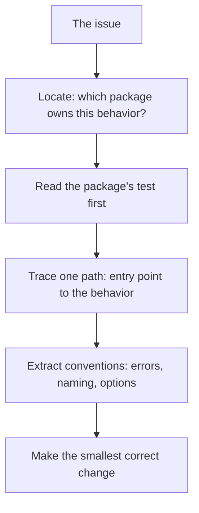

# Understanding a Go codebase fast

## Why Does This Matter?

Every contribution begins with reading code you have never seen, on a
deadline you set yourself (an evening, a weekend). Go codebases reward
a specific reading strategy: they are flatter than Java or C#
hierarchies, tests sit next to the code, and the tooling can tell you
things source-scrolling cannot. Reading well is also the job: most
review comments on first PRs are about matching the codebase's
conventions, not your algorithm. Learn to extract a codebase's
conventions quickly and your PRs read like a regular's.

## Mental Model

You are not trying to understand the codebase; you are trying to
understand the *neighborhood* of your change. A contribution touches
one or two packages, their tests, and the callers of what you modify.
Everything else is context you rent, not own:



## How It Works: the reading order that pays

1. **Start from the failing behavior, not `main()`.** Find the test or
   issue repro that demonstrates the bug. Behavior-first reading beats
   architecture-first reading for contribution work.
2. **Read the package's `_test.go` before its source.** Tests are the
   package's executable specification: they show intended use, error
   expectations, and the boundaries the authors care about.
3. **Let the tools build the map:**
   - `go doc -all ./pkg` reads better than scrolling: it shows the
     exported surface without implementation noise.
   - `go list -deps ./pkg | head` reveals what the package believes it
     depends on.
   - In the editor, "find references" on the function you will change
     tells you your blast radius in seconds. That number scopes the PR.
4. **Extract conventions by example.** Before writing a line, answer
   from the surrounding code: How does this package return errors
   (sentinel, typed, wrapped with `%w`)? Does it use functional options
   or plain constructors? Where do interfaces live: consumer side or
   producer side? Copy the house style even where you prefer yours.
5. **Trace one happy path and one error path.** Two traces give you
   the real shape; twenty files of skimming do not.

## Syntax / API: the commands

```bash
go doc -all ./internal/transport      # exported surface, no noise
go list -f '{{.Imports}}' ./...       # who imports what
go test ./internal/transport -run TestName -v   # the behavior you will touch
```

Editor equivalents: gopls' references and call hierarchy
([11 §1](../11-tooling/01-professional-workflow.md)) do steps 3 and 4
interactively.

## Real-World Example

Contributing to a client like franz-go: the issue is about consumer
group rebalance behavior. The neighborhood is the consumer-group
package, its tests (which mock the coordinator protocol), and the
config plumbing. You do not need to read the produce path at all, and
reading it wastes your evening. The discipline of not reading is half
the skill.

## Common Mistakes

- **Reading top-down out of habit.** Java-style deep hierarchies force
  it; Go's flat packages rarely need it. Start where the behavior is.
- **Skipping the tests.** You will rediscover conventions the tests
  already state, and your PR will contradict them.
- **Changing style mid-package.** A PR that renames things to your
  taste fails review on principle, regardless of technical merit.
- **Not checking internal packages.** Go's `internal/` visibility rule
  ([06 §1](../06-packages-modules/01-package-design.md)) sometimes
  means the fix you want must be exported through a deliberate API
  change, which is a discussion, not a PR.

## Idiomatic Go

Reading Go well means reading *signatures* well: a function that takes
a `context.Context` first, an `io.Reader`, and returns `(T, error)`
tells you its whole contract before you read a line of its body. When
you can skim a package's exported signatures and predict its tests,
you are ready to modify it.

## Interview Questions

1. *You join a team with a large unfamiliar Go codebase and must ship
   a fix this week. Walk me through your first day.*: Behavior-first
   location, tests-as-spec, references for blast radius, convention
   extraction; grade on method, not speed claims.
2. *How do you know your change is safe?*: The references count, the
   package tests, and the one error path you traced; "I read
   everything" is not an answer.

## Practice Exercises

1. Take a mid-sized Go repository you admire. In under 30 minutes,
   write down: its error convention, its interface placement, and its
   option-passing style. Check yourself against a real PR diff.
2. Run `go doc -all` on one of this handbook's example packages and on
   one stdlib package; note what each surface tells you about intent.
3. Find the callers of a function in an open-source Go project and
   estimate the blast radius of changing its signature. Verify with
   the project's own refactor history.

## Further Reading

- [go doc command](https://go.dev/cmd/go/#hdr-Show_documentation_for_package_or_symbol)
- [Effective Go: package names and visibility](https://go.dev/doc/effective_go#names) (style context, not license to copy)
- [gopls: editor features](https://go.dev/gopls/)
