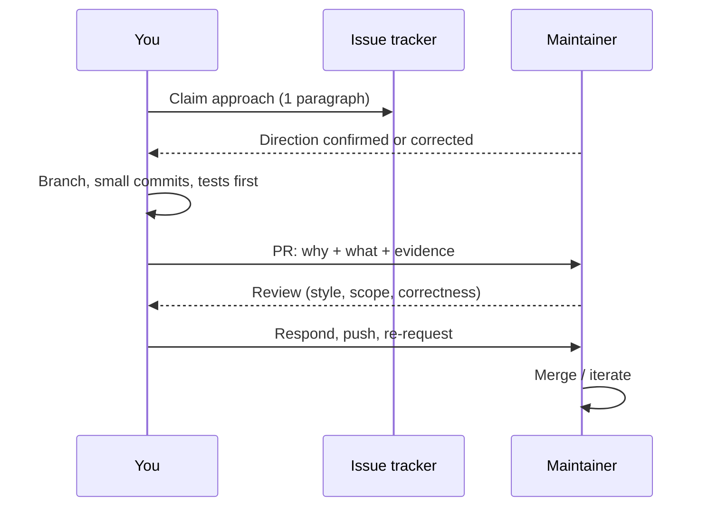

# Contributing well: the issue → PR → review loop

## Why Does This Matter?

This is the mechanic chapter: the loop every contribution travels, from
issue to merged commit. Projects differ in tooling (GitHub, Gerrit,
Gitea) but not in the loop's logic: claim, clarify, deliver small,
review in both directions. Master it once and it transfers everywhere,
including to the Go project itself, whose Gerrit flow is a variation on
the same theme (see the special section below).

## Mental Model

A PR is a persuasive artifact, not a code dump. Its readers are busy
volunteers deciding whether your change is safe to own *forever*:

The two-way arrows are the loop. Most rejected PRs failed at an arrow:
unclaimed approach, unanswerable description, or review replies that
argue instead of adjust.

## How It Works

### Good issues

A good issue is reproducible, scoped, and states impact:

- **Bug report:** exact version (`go version`), minimal repro, expected
  vs actual, and what you already ruled out. This handbook's own
  [bug template](../.github/ISSUE_TEMPLATE/bug_report.md) encodes the
  shape; quote-based reports get fixed fastest everywhere.
- **Feature request:** the problem, not the solution. "I cannot retry
  idempotent publishes without reordering" invites design; "add option
  X" invites a debate about option X.
- **Before filing:** search first (duplicates are the highest-friction
  thing a maintainer handles), and verify against the latest release,
  not the one you deployed last year.

### Good PRs

The anatomy of a PR that merges:

1. **Small scope.** One behavior change. If the issue needs more, it
   needs a series of PRs; say so and let the maintainer sequence them.
2. **Tests in the same PR,** written to fail without your change.
   "Tests to follow" is where PRs go to die.
3. **A description that explains why.** Link the issue, state the
   approach in two sentences, and show the evidence: benchmark before/
   after ([19 §1](../19-performance/01-measure-first.md) style), the
   failing-then-passing test, the doc quote that was wrong.
4. **Green and formatted before you open it.** The project's CI command
   list ([11 §1](../11-tooling/01-professional-workflow.md)) run
   locally is table stakes; a red PR spends its first impression on
   noise.
5. **Commits that tell the story.** Small, single-purpose commits with
   imperative messages (`fix: bound scanner buffer in chunk reader`).
   Rebase-squash before review if the project prefers linear history.

### Review: giving and receiving

- **Receiving:** respond to every comment (even "done, thanks");
  distinguish "changed" from "question"; push follow-up commits or
  force-push only per house convention, and re-request review. If a
  comment is wrong, bring evidence (a benchmark, a doc link), not
  volume. A disputed technical call resolves with data or with the
  maintainer's decision, and either way the PR moves.
- **Giving:** review the code against the project's standards, not
  your preferences; label comments blocking vs nit; test locally when
  the CI cannot; and review the tests as hard as the code. The habit
  this handbook's [PR template](../.github/pull_request_template.md)
  encodes: checklists turn review into a repeatable pass.

### The paperwork you will actually hit

- **CLA/DCO.** Some projects (and the Go project itself) require a
  Contributor License Agreement; many others require DCO sign-off
  (`git commit -s`). Read which, once, before the first PR; it is the
  most common mechanical rejection.
- **Commit sign-off and email.** Gerrit-based projects need a verified
  email and change-Id; GitHub projects need nothing but the PR.
- **Language and conduct.** Follow the project's code of conduct as
  written; terse review styles are cultural, not personal.

## Real-World Example

The loop in practice, this repository as the specimen: a reader finds a
wrong claim about GC pacing. They file a quote-based bug issue (the
exact sentence and why it is wrong), the fix is one paragraph plus a
corrected test, the PR description links the release notes that prove
the claim, and review takes one round. Total maintainer time: minutes.
That is the shape to imitate: every element designed so the reviewer's
decision is easy.

## Common Mistakes

- **The drive-by mega-PR:** "I fixed the bug and reformatted three
  packages." The reformat hides the fix; both stall.
- **Arguing style in review.** House style wins; your preference is a
  separate, discussed-on-its-own-merits proposal.
- **Disappearing after opening.** If you cannot finish, say so early
  and mark the PR as such; abandoned PRs cost more trust than honest
  withdrawals.
- **Fixing the symptom in a downstream fork.** Carry-patches accrete;
  upstream the fix or document the divergence.

## Idiomatic Go

PRs in Go projects get reviewed for the things Go makes cheap to get
right: `gofmt` clean, `go vet` and staticcheck silent, errors wrapped
with `%w` where callers need identity ([05 §1](../05-errors/01-errors-are-values.md)),
context plumbed for cancellation, table-driven tests
([10 §1](../10-testing/01-fundamentals.md)). When your diff
already satisfies these, review shrinks to the actual logic, which is
where you want the maintainer's attention.

## Interview Questions

1. *Your PR receives a review comment you believe is factually wrong.
   What do you do?*: Verify first, respond with evidence and a
   reproduction or doc link, and distinguish blocking from preference;
   grade on de-escalation plus correctness.
2. *How do you split a large contribution so it can merge?*: Series of
   independent, individually-testable PRs sequenced with the
   maintainer; the first PR earns the rest.
3. *What makes review fast for the reviewer?*: Small diff, tests that
   demonstrate the behavior, why-first description, green CI, and
   responsive follow-up.

## Practice Exercises

1. Take any closed PR in a Go project you use and reconstruct its
   review timeline: how many rounds, what categories of comment, and
   what would have prevented the avoidable ones.
2. Review a real open PR in a Go repository using the blocking/nit
   discipline; submit it if the project welcomes drive-by reviews.
3. Write the "why" paragraph for a change you made at work this month,
   as if it were an upstream PR description; notice what evidence you
   are missing.

## Further Reading

- [Open Source Guides: the anatomy of a good PR](https://opensource.guide/how-to-contribute/)
- [GitHub docs: reviewing changes in pull requests](https://docs.github.com/en/pull-requests/collaborating-with-pull-requests/reviewing-changes-in-pull-requests)
- [DCO](https://developercertificate.org/) and [CLA assistance tool](https://cla-assistant.io/) background
- This repository's [CONTRIBUTING.md](../CONTRIBUTING.md) and [PR template](../.github/pull_request_template.md): the worked example
