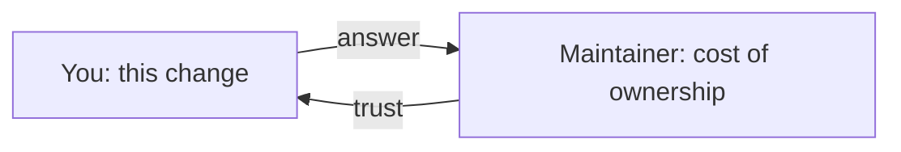

# Maintainer communication & long-term contribution

## Why Does This Matter?

The difference between a one-PR contributor and a recognized one is
not code volume; it is communication that respects the maintainer's
scarcest resources: attention and context. Projects remember
contributors who make decisions easy, keep commitments small and
honest, and stay pleasant under disagreement. This chapter covers the
conversations around the code, because those are where contributions
actually stall: in scope that was never negotiated, "no" that was
taken personally, and enthusiasm that overcommitted.

## Mental Model

Maintainers optimize for the project's next five years; contributors
optimize for this PR. Neither is wrong, but every scope disagreement
is this gap showing up in a chat thread. The bridge is to make their
problem yours: maintenance cost, review capacity, and the API surface
they must support forever.

## How It Works

### Negotiating scope

- **Anchor on the problem.** "Sessions leak on restart" admits six
  solutions; "add a session TTL option" admits one. Bring a proposed
  solution, but tie it visibly to the problem so the maintainer can
  redirect cheaply.
- **Offer the smallest version first.** An internal fix that removes
  80% of the pain is easier to accept than the full-featured public
  API. You can grow it later; you cannot easily shrink a shipped one
  (the compatibility discipline from [06 Section 5](../06-packages-modules/05-reproducible-builds.md)
  and the versioning habits in [06 Section 6](../06-packages-modules/06-semantic-versioning.md)).
- **Write the decision down.** A short issue comment: what was agreed,
  what was explicitly out of scope. It prevents the slow PR drift that
  exhausts both sides.

### Handling "no"

A "no" to a feature is a statement about the project, not about you.
The professional moves:

1. Ask one clarifying question ("is the concern the API surface, or
   the maintenance cost?"). Often the "no" is really "not this shape."
2. Accept the answer gracefully and close the loop. Maintainers track
   who argues; they also track who did not, and the second group gets
   their next PR reviewed faster.
3. If the need is real for you, maintain it in your own fork or as a
   small module, and keep the upstream seam clean ([18 Section 2](../18-kafka-with-go/02-go-clients.md)'s
   transport/domain seam applies to your patch too).

### The habits of long-term contributors

- **Reliability beats brilliance.** Three small, always-green PRs buy
  more trust than one ambitious stalled one.
- **Claim ownership explicitly.** "I will have the updated patch by
  Sunday" is worth ten apologetic delays. Then hit it, or renegotiate
  before the deadline, not after.
- **Become useful in the maintainer's absence.** Triaging issues with
  accurate reproductions, reviewing newcomers, keeping docs honest.
  Projects with BUS-factor anxiety promote contributors who de-risk
  them.
- **Take the boring work.** Release notes, changelogs, deprecation
  migrations, CI flake hunts: low-glory, high-trust. This is where
  commit access comes from.
- **Upgrade the relationship.** Once you have context, propose: a
  roadmap item, a test-infra improvement, a docs pass. Senior
  contributors are the ones who carry context, not the ones who carry
  the biggest diff.

## Real-World Example

The standard arc in a mature Go project: contributor fixes a small bug
(credibility), picks up an issue tagged "help wanted" and negotiates
scope to a two-PR series (collaboration), then takes over the
issue-triage rotation for a month (ownership). By the time a
maintainer role is offered, the last three decisions were already
theirs. Nothing about the arc required exceptional code; it required
showing up predictably.

## Common Mistakes

- **Scope creep disguised as thoroughness:** the PR that grows a
  feature, tests for an adjacent bug, and a README rewrite. Each is
  reviewable alone; together they are a month of review latency.
- **Treating review latency as rejection.** Maintainers sleep, ship,
  and take PTO. Follow the project's stated ping etiquette.
- **Relitigating closed decisions.** Reopening a settled "no" every
  quarter is the fastest way out of a project's trust circle.
- **Building public attention before maintainer alignment.** A viral
  issue or a Reddit thread lobbying for your PR reads as pressure and
  burns the relationship.

## Idiomatic Go

Where you invest long-term matters: Go's ecosystem rewards
contributors who can read the stdlib source fluently (it is the style
reference for everything), keep module compatibility promises, and
write tests that pin behavior ([10 Section 4](../10-testing/04-benchmarks-coverage-fuzzing.md)'s
fuzzing habit catches real bugs upstream and is always welcome). A
maintainer reading your fifth PR should be able to merge it on the
tests alone.

## Interview Questions

1. *A maintainer rejects your well-designed feature. Walk me through
   your response.*: One clarifying question, graceful acceptance,
   fork-or-module alternative if the need is real; grade on
   relationship preservation.
2. *How would you grow from occasional contributor to trusted one?*:
   Reliability, triage ownership, boring work, context-building;
   grade on the maintainer's perspective, not your resumé.
3. *Your PR scope is drifting after review feedback. What now?*:
   Split the diff, write down agreed scope, sequence follow-ups;
   never silently absorb scope.

## Practice Exercises

1. Pick a closed feature request where the maintainer said no. Write
   the one clarifying question you would have asked, and the
   smallest-version counter-proposal.
2. Draft a two-PR split for a change you want to make in a project of
   your choice: what lands first, what depends on what, and what you
   would explicitly defer.
3. Spend 30 minutes triaging a project's untriaged issues: reproduce
   one, confirm versions, and write the comment you would post.

## Further Reading

- [Kubernetes: contributor guide and SIG governance](https://github.com/kubernetes/community/blob/master/contributors/guide/README.md): long-term contributor structure at scale
- [The gentle art of patch rejection](https://www.redhat.com/en/blog/gentle-art-patch-rejection) (classic maintainer-side view)
- [Open Source Guides: leadership and governance](https://opensource.guide/leadership-and-governance/)
