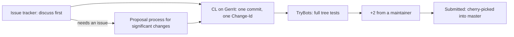

# Special section: Contributing to Go

## Why Does This Matter?

The Go project is not just another repository: it is the reference
implementation, the standard library, the compiler, and the toolchain
your whole career compiles against. Its contribution process is
deliberately different from the GitHub flow most engineers know, and
the differences are the first hurdle, not the code. This section walks
the official process end to end ([go.dev/doc/contribute](https://go.dev/doc/contribute)),
translated into the contribution loop from
[27 Section 3](03-contributing-well.md).

## Mental Model

The Go project runs review-first development on Gerrit, a
changelist-based review tool, with GitHub as a supported bridge:



Two ideas organize everything: **discussion happens in the issue
tracker** (the review tool is only for implementation), and **every
change is one commit** that is amended in place rather than stacked.

## How It Works: the setup, once

1. Pick one Google account and configure git to commit with it.
2. Sign the CLA (individual, or corporate if your employer owns the
   work; check with your employer first). The CLA is checked on every
   CL, so a missing or mismatched email is the most common mechanical
   failure.
3. Generate credentials at [go.googlesource.com](https://go.googlesource.com)
   ("Generate Password" writes a `.gitcookies` entry).
4. Register on Gerrit at [go-review.googlesource.com](https://go-review.googlesource.com).
5. Install the helper: `go install golang.org/x/review/git-codereview@latest`
   (or run `go-contrib-init`, which walks the whole setup).

Steps 2 and 4 need doing only once per account.

## How It Works: the change loop

- **Clone from go.googlesource.com, not GitHub.** Build once:
  `./all.bash` in `go/src` (or `go test ./...` in an `x/` repo).
- **One branch, one commit.** Instead of `git commit`, use
  `git codereview change`; it creates (or amends) the single commit and
  attaches a `Change-Id` that Gerrit uses to match later uploads. Never
  edit or delete that line.
- **Send with `git codereview mail`** (despite the name, nothing is
  emailed; it uploads to Gerrit and prints the CL URL).
- **Revise by amending:** edit, stage, `git codereview change`,
  `git codereview mail` again. Same commit, same Change-Id, new
  review round. This is Gerrit's shape: there is no force-push, the
  change *is* the commit.
- **Close every review comment.** Treat each comment as a ticket:
  implement and click "Done", or reply explaining what you did
  instead. Multiple rounds are normal for every contributor.

### The commit message format is enforced

```
math: improve Sin, Cos and Tan precision for very large arguments

The existing implementation has poor numerical properties for
large arguments, so use the McGillicutty algorithm to improve
accuracy above 1e10.

Fixes #159
```

- First line: `package: lowercase summary`, written to complete
  "This change modifies Go to ____". Not a sentence, no capital, no
  period.
- Body: prose, wrapped near 72 columns, no Markdown. Include benchmark
  data formatted with `benchstat` when the change is a performance
  claim.
- `Fixes #159` closes the issue on submit; `Updates #159` links
  without closing. In `golang.org/x/` repos use the fully-qualified
  `Fixes golang/go#159` because most issues live in the main tracker.

## Where to plug in

- **Labels.** `NeedsFix` (understood, code welcome), `NeedsDecision`
  (the Go team has not decided; wait or politely ping), and
  `NeedsInvestigation` (root cause unknown). Start with `NeedsFix`.
- **Issue first, always.** Except trivial changes, every CL needs a
  linked issue where the approach was agreed.
- **Proposals.** Significant language, library, API, or tool changes go
  through the [proposal process](https://github.com/golang/proposal)
  (a design document reviewed in the tracker) *before* any CL exists.
  Writing a good proposal is a distinct skill: motivate the problem,
  survey alternatives, state the compatibility impact.
- **The x/ repositories.** `x/tools` (gopls), `x/mod`, `x/sync`, and
  friends use the same process with lower ceremony and are excellent
  first targets; several are where most working Go engineers can
  contribute meaningfully.

## Compatibility: the review context you must respect

The Go 1 compatibility promise means every standard library and
language change is judged against "what will this break in ten years?"
In practice: no breaking signature changes, new API only through the
proposal process, behavior changes argued in the issue tracker, and a
six-month release cycle whose second half is a feature freeze (CLs
sent during freeze are reviewed later; `R=go1.XX` marks the window).
Understanding this reframes review comments that look pedantic and are
actually fifty-year cost accounting.

## GitHub PRs are supported, with caveats

GerritBot syncs a GitHub PR into a Gerrit CL, and review comments flow
back to the PR. But: you still need a Gerrit account to respond and
mark comments "Done"; all commits are squashed on acceptance with the
PR title + description becoming the commit message (your per-commit
messages are discarded); and the commit message conventions still
apply. If you live on GitHub, contribute by PR; if you plan to
contribute often, learn Gerrit: it is the smoother workflow here.

## Voting and the two-employee rule

A CL submits with `Code-Review +2` from a maintainer (approver);
`+1` is encouragement or "minor changes first", and a maintainer can
place `Hold +1` to park a CL (for example, while a proposal is still in
review). Submission also requires Google-employee involvement as
uploader or reviewer, a supply-chain compliance requirement, not a
merit judgment of your patch.

## Common Mistakes

- **Sending a CL with no linked issue.** Review stops; consensus is
  the tracker's job.
- **Stacking commits or deleting the Change-Id.** Each branch is one
  commit; squash with `git rebase` if you slip.
- **Wrong email vs the registered account** (the classic `mail`
  failure; `git config user.email` locally and amend).
- **Proposing API in the CL instead of the tracker.** High-level
  design in code review gets redirected every time.
- **Updating copyright years** on files you touch; headers are set at
  file creation (`Copyright 2026 The Go Authors`).

## Interview Questions

1. *Why does the Go project use Gerrit instead of GitHub PRs?*: One
   commit per change, amend-in-place review, Change-Id identity across
   rounds, trybot integration; grade on understanding the model, not
   tool loyalty.
2. *Your stdlib change needs a new exported function. What is the
   path?*: Proposal process first, compatibility argument, then the CL
   after consensus; a CL cannot carry the design decision.
3. *What does the compatibility promise change about how reviews
   judge your patch?*: API surface is forever; reviewers weigh
   maintenance and breakage cost, not just correctness.

## Practice Exercises

1. Run `go-contrib-init` in a scratch clone and complete the setup
   (skip CLA submission if under 18 or uncomfortable; observe each
   step). Write down what surprised you.
2. Read five merged commit messages in the Go repo with the format
   rules above in hand; note how `Fixes`/`Updates` and benchstat
   blocks are used in practice.
3. Pick an open `NeedsFix` issue in an `x/` repo, reproduce it, and
   write (do not send) the issue comment claiming it with your
   approach.

## Further Reading

- [Official Contribution Guide](https://go.dev/doc/contribute)
- [Go proposal process](https://github.com/golang/proposal)
- [CodeReview wiki](https://go.dev/wiki/CodeReview): the community-maintained review guide
- [Go 1 compatibility promise](https://go.dev/doc/go1compat)
- [Gerrit for GitHub users](https://gerrit-review.googlesource.com/Documentation/intro-gerrit-walkthrough-github.html)
