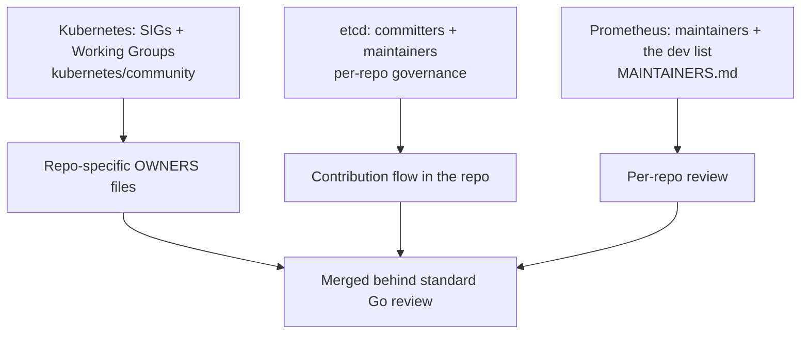

# Special section: Contributing to Go-based infrastructure

## Why Does This Matter?

The systems you run in production are mostly written in Go:
Kubernetes, etcd, Prometheus, containerd, Traefik, Caddy, and much of
the CNCF landscape. These are the largest Go codebases in the world,
with the most mature review processes, and they are where a Go
engineer's contribution has the widest blast radius. They are also
where open-source contribution becomes a career asset: a merged
Kubernetes PR is reviewed by the people who defined Go's
production patterns.

## Mental Model

Each project routes contributions through its own governance layer:

The shared shape: **special-interest groups (SIGs) or maintainer
teams own areas**, OWNERS files decide who can approve what, and
escalation happens through community meetings and the dev mailing
list or Slack, never through PR pressure.

## How It Works: the entry points

### Kubernetes

- Find your area's SIG (networking, storage, node, apps, ...). Every
  SIG has public meetings, notes, and a Slack channel; feature work
  is agreed there before it exists as a KEP (Kubernetes Enhancement
  Proposal, the project's version of a design doc).
- The [contributor guide](https://github.com/kubernetes/community/blob/master/contributors/guide/README.md)
  and `good-first-issue` labels across the kubernetes org are the
  documented front door. Docs, flaky-test triage, and release-notes
  work are the classic on-ramps.
- Security-relevant areas run stricter review; expect CLA + DCO
  checks, `/lgtm` + `/approve` from OWNERS, and bots enforcing the
  process (`k8s-ci-robot`). Learn the bot commands early; they are
  the project's review protocol.

### etcd

- Smaller surface, deep review. The repo's own contributing docs
  govern; issues are triaged by maintainers, and tests-plus-benchmarks
  evidence is expected for anything touching the raft or storage
  paths.
- Because etcd underpins Kubernetes control planes, correctness
  arguments in review are rigorous; bring the quorum/fencing reasoning
  from [16 Section 3](../16-distributed-systems/03-leader-election-leases-fencing.md)
  when discussing leader and lease behavior.

### Prometheus

- Governance is documented in the repo (maintainers list, the
  dev mailing list, community calls); components (server, exporters,
  client_golang) review at different tempos.
- `client_golang` (the Go metrics client this handbook wires in
  [20 Section 2](../20-observability/02-metrics.md)) is one of the most
  approachable high-impact targets in the entire ecosystem: a
  well-tested PR there lands in every Go service's dependency tree.

## What transfers from smaller projects, what does not

**Transfers:** the contribution loop from [27 Section 3](03-contributing-well.md),
failing-test-first discipline, small diffs, why-first descriptions,
evidence-based review replies, and DCO/CLA hygiene.

**Does not transfer:** speed expectations (review latency is weeks at
feature-freeze times), personal review attention (bots triage, humans
approve), and the ability to design API in the PR. Large projects
design through proposals (KEP for Kubernetes, design docs in the dev
list for Prometheus); the PR implements an already-agreed design.

## A realistic first-year arc

1. **Quarter 1:** docs fixes, test flake reproduction, changelog
   work; learn the bots and the OWNERS flow.
2. **Quarter 2:** pick up `help wanted` issues in one component
   consistently; attend that SIG/maintainer meeting silently at
   first, then with repro data.
3. **Quarter 3:** own a small feature end to end: proposal, review
   cycle, implementation, release notes.
4. **Quarter 4:** review others in your area; this is when
   maintainers start asking your opinion, and when reviewer/approver
   paths (Kubernetes: OWNERS membership) open.

## Common Mistakes

- **Skipping the SIG/design venue.** A surprise PR implementing an
  undesigned feature is redirected regardless of quality.
- **Bargaining with bots.** The CLA/DCO/lint checks are not opinions;
  fix them mechanically.
- **Spreading across five projects.** Recognition compounds in one
  community; it dilutes across five.
- **Ignoring meeting notes and proposals history.** Most "obvious
  improvements" were proposed and rejected before, with reasons in
  the notes; reading history prevents relitigating.

## Interview Questions

1. *How does contribution review differ between Kubernetes and a
   mid-sized Go library?*: Governance layers (SIG/KEP/bots vs direct
   maintainer), latency expectations, design-venue separation.
2. *You found a real bug in etcd's lease handling with a repro. What
   is your path to a merge?*: File with repro and version, claim with
   approach, failing test first, evidence-based review rounds; grade
   on process patience and correctness argument.

## Practice Exercises

1. Map one Kubernetes SIG's recent meeting notes for a month: list
   the enhancements discussed and where each is in the KEP pipeline.
2. Pick one `client_golang` issue, reproduce it with the metrics
   patterns from [20 Section 2](../20-observability/02-metrics.md), and
   draft the PR description.
3. Read one merged KEP end to end and one rejected KEP; write down
   what each process actually decided and why.

## Further Reading

- [Kubernetes contributor guide](https://github.com/kubernetes/community/blob/master/contributors/guide/README.md) and [KEP process](https://github.com/kubernetes/enhancements)
- [etcd contributing](https://github.com/etcd-io/etcd/blob/main/CONTRIBUTING.md)
- [Prometheus governance](https://prometheus.io/community/) and [client_golang](https://github.com/prometheus/client_golang)
- [CNCF contributor strategy](https://www.cncf.io/contributors/)
