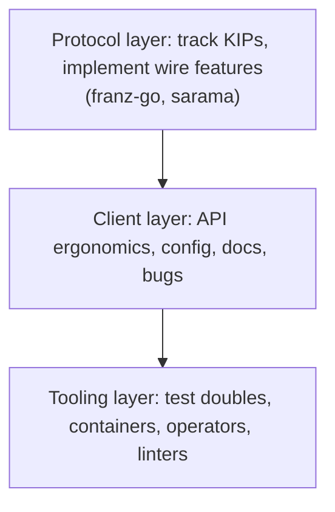

# Special section: Contributing to the Kafka-in-Go ecosystem

## Why Does This Matter?

Kafka is infrastructure with a large Go surface: the clients you chose
between in [18 Section 2](../18-kafka-with-go/02-go-clients.md) (franz-go,
sarama, segmentio, confluent-kafka-go), the test tooling you rely on
(testcontainers modules, mock brokers), and the operations tooling
around brokers. These projects sit at the intersection of two
communities (the Kafka JVM world and the Go world), which makes them
unusually good places for a Go engineer to contribute: protocol-level
work is well-specified, and the Go-side tooling is younger and
understaffed relative to its user count.

## Mental Model

The ecosystem has three contribution layers, with different skills and
different review cultures:

Most contributors should enter at the tooling layer (smallest,
best-scoped work) and grow toward the protocol layer as they build
confidence in the project's conventions.

## How It Works: what each layer actually needs

### Protocol and feature work (clients)

- **KIP tracking is the currency.** Kafka evolves through Kafka
  Improvement Proposals; when a KIP is accepted, client projects race
  to support it (the new consumer group protocol in KIP-848 is the
  recent example). Watching the KIP queue in the Apache Kafka wiki and
  claiming an unimplemented KIP in your client's tracker is the
  highest-leverage feature contribution available.
- **Compatibility matrices are documentation.** Client READMEs map
  broker versions to features; correcting or extending them after
  real testing is small, verifiable, valuable work.
- **Expect protocol review to demand evidence:** captured wire
  traffic, compatibility notes across broker versions, and benchmarks
  formatted the way [18 Section 4](../18-kafka-with-go/04-observability-tuning.md)
  measures throughput.

### Client ergonomics, bugs, and docs

- Error-path documentation is chronically weak: which retriable
  errors surface, what the client does on coordinator failover, what
  happens to buffered records on `Close`. Documenting *observed*
  behavior (with a test that pins it) beats aspirational docs.
- Rebalance, offset-commit, and delivery-guarantee bugs are the
  high-value bug classes; reproduce with the in-memory harness from
  [17 Section 4](../17-messaging/04-schemas-evolution-and-testing.md) where
  possible before filing.

### Test tooling and infrastructure

- **testcontainers modules** for Kafka (and schema registries) are
  the standard way Go integration tests get a real broker; keeping
  them current with broker releases and listener/SASL configurations
  is continuous, mergeable work.
- **Mock brokers and harnesses:** franz-go's `kfake`, sarama's
  mocks. Improving fidelity (e.g. coordinator behavior, error
  injection) helps every downstream user.
- **Operators and monitoring exporters** (strimzi-adjacent tooling,
  Kafka exporters) take Go and Kubernetes skills this handbook
  teaches in [22 Section 5](../22-production-go/05-deploying-kubernetes.md)
  and [20 Section 2](../20-observability/02-metrics.md).

## The contribution shape that gets merged

The pattern this handbook's own Kafka section models
([18-kafka-with-go](../18-kafka-with-go/README.md)) is the pattern
these projects merge most easily:

1. Reproduce the problem in a failing test first (deterministic,
   no live broker required unless the bug is broker-specific).
2. Minimal fix, transport-layer only, no API change unless agreed in
   an issue first.
3. Evidence in the PR description: the failing-then-passing test run,
   benchmark table if performance-related, broker version tested
   against.
4. Docs updated in the same PR, including the compatibility matrix
   row that changed.

## Where the two communities meet: KIPs

Understanding KIP mechanics is the ecosystem's special skill: read
the proposal, its mailing-list debate, and its compatibility notes
before implementing. A Go contributor who can say "this KIP changes
the fetch session semantics, here is what our client must do about
the `SESSION_EXPIRED` path" is doing work the JVM-side community
cannot: translating protocol intent into client behavior.

## Common Mistakes

- **Filing "it doesn't work" against a broker version the client
  does not support.** Check the compatibility matrix first; version
  mismatch is half of all client bugs.
- **Implementing a KIP without claiming it.** Two people finishing
  the same KIP wastes one entirely; comment intent early.
- **Testing only against a single broker in Docker.** Client bugs
  hide in version skew and cluster behavior; state exactly what you
  tested (broker versions, topology, auth) in the PR.
- **Mixing transport changes into domain-facing PRs** in ecosystem
  tools; the seam discipline from [18 Section 3](../18-kafka-with-go/03-producer-consumer.md)
  applies to your patch too.

## Interview Questions

1. *How would you get your first merged PR into a Kafka Go client?*:
   Tooling layer entry (testcontainers, mocks, docs), failing-test-
   first bug fixes, KIP tracking for features; grade on knowing the
   layers, not name-dropping.
2. *A new KIP lands that your service needs. Walk me through your
   move.*: Read the KIP and compatibility notes, check client tracker
   for existing work, claim or implement with evidence, file the
   upstream PR before carrying a local patch.

## Practice Exercises

1. Pick one accepted-but-unimplemented KIP in the franz-go or sarama
   trackers. Write the issue comment claiming it, with your reading
   of the protocol changes it requires.
2. Add one missing error-path paragraph to a client's documentation,
   verified against the code, and open the PR.
3. Extend a testcontainers Kafka module test to cover a SASL
   configuration you use in production, and report any fidelity gaps
   you find.

## Further Reading

- [franz-go](https://github.com/twmb/franz-go): CONTRIBUTING and the kfake harness
- [IBM/sarama](https://github.com/IBM/sarama): issue tracker and mock packages
- [Apache Kafka KIP process](https://kafka.apache.org/contributing) and the KIP index in the wiki
- [testcontainers-go Kafka module](https://golang.testcontainers.org/modules/kafka/)
