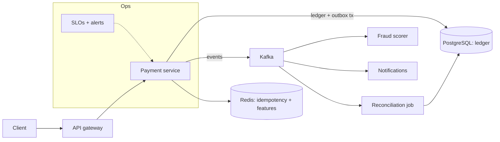

# Level 5: Capstone

## Production-Grade Financial Transaction Platform

One system, everything the handbook teaches. The capstone is a
payment platform: money in, money out, an immutable ledger beneath,
an event backbone, real deployment, real observability, and the
operational discipline to run it. It is deliberately the last thing
in this handbook: every component maps to a section you have already
read, and the project's value is in *assembling them under their real
tensions*: correctness against latency, delivery guarantees against
throughput, features against operability.

> **Educational scope:** production-shaped, not production-certified.
> See the standing disclaimer in [25](../25-fintech-with-go/README.md).

## What you are building

A payment platform with four services and one shared backbone:

| Component | Handbook section it implements |
|---|---|
| Service layout, config, graceful shutdown | [14](../14-backend-development/README.md), [22 Section 1](../22-production-go/01-configuration-and-secrets.md), [22 Section 2](../22-production-go/02-server-lifecycle.md) |
| REST transport + gateway | [12](../12-http-networking/README.md), [24 Section 2](../24-system-design/02-rate-limiter-and-gateway.md) |
| gRPC (one internal hop) | [15 Section 2](../15-microservices/02-boundaries-and-contracts.md) |
| Double-entry ledger | [25 Section 2](../25-fintech-with-go/02-double-entry-ledger.md) |
| Idempotent payment execution | [25 Section 3](../25-fintech-with-go/03-integrity-and-exactly-once.md), [24 Section 3](../24-system-design/03-payment-service-and-ledger.md) |
| Kafka event backbone | [18](../18-kafka-with-go/README.md) |
| Redis idempotency + caching | [13 Section 5](../13-databases/05-caching-with-redis.md) |
| Fraud scoring (rules + async model) | [25 Section 4](../25-fintech-with-go/04-risk-and-compliance.md) |
| Reconciliation job | the Level 4 scheduler pattern, [25 Section 3](../25-fintech-with-go/03-integrity-and-exactly-once.md) |
| OpenTelemetry: logs/metrics/traces | [20](../20-observability/README.md) |
| Docker + Kubernetes + CI/CD | [22 Section 5](../22-production-go/05-deploying-kubernetes.md), [22 Section 6](../22-production-go/06-releases-and-rollbacks.md) |

## Build order: six milestones

The order matters: each milestone ends in a demonstrable, tested
state, and none of them says "and then add everything."

### M1: The spine (ledger + payment core)

- Payment service with the [14 Section 1](../14-backend-development/01-service-layout.md)
  layout: domain, service, transport, platform.
- Ledger in Postgres exactly per [25 Section 2]: immutable postings,
  balanced transfers, integer minor units.
- Idempotency keys end to end: the four-step commit ordering.
- **Gate:** conservation property test green under `-race`; the
  unknown-PSP-response suite (Level 4 M2) adapted and green.
- **Not yet:** Kafka, Redis, Kubernetes. Resist.

### M2: The backbone (events + consumers)

- Outbox relay publishes payment events ([15 Section 4](../15-microservices/04-idempotency-sagas-outbox.md)).
- Consumers: notifications (Level 3 M4 shape) and fraud rules
  (synchronous hard rules first).
- **Gate:** the M4/M5 failure-day tests from Level 3's order
  service, passing against your backbone.

### M3: The edge (gateway + gRPC + caching)

- Gateway with authn, two-layer rate limiting, and request IDs
  ([21 Section 4](../21-security/04-limits-and-hardening.md)).
- One internal hop as gRPC with a versioned proto ([15 Section 2](../15-microservices/02-boundaries-and-contracts.md)).
- Redis for idempotency lookups and feature caching with singleflight.
- **Gate:** load test at target RPS: p99 latency budget met, limiter
  sheds before saturation, cache stampede test green.

### M4: The eyes (observability)

- OTel wired per [20 Section 3](../20-observability/03-tracing-and-otel.md):
  one trace spans gateway → payment → Kafka → consumer.
- RED metrics on every service; business metrics (charges by status)
  per [20 Section 2](../20-observability/02-metrics.md).
- SLOs defined and *burning correctly*: pick two
  ([20 Section 4](../20-observability/04-slos-and-alerting.md)):
  availability and charge-latency p99 are the natural pair.
- **Gate:** the incident drill: inject a broker outage on staging,
  debug it end to end using only your own dashboards
  ([20 Section 5](../20-observability/05-incident-debugging.md)). Time
  yourself.

### M5: The wings (containers, K8s, CI/CD)

- Distroless images, resource limits per [22 Section 3](../22-production-go/03-resource-limits.md),
  GOMEMLIMIT set to the cgroup budget.
- K8s manifests with startup/readiness/liveness roles done right
  ([22 Section 5](../22-production-go/05-deploying-kubernetes.md)): readiness
  checks dependencies, liveness never does.
- CI/CD with the blast-radius ladder ([22 Section 6](../22-production-go/06-releases-and-rollbacks.md)):
  flag → canary → rollback, N/N-1 compatibility verified in CI.
- **Gate:** a rollback drill: deploy N+1 with a planted bug, detect
  via SLO burn, roll back, assert zero money-state damage (the
  ledger made the deploy safe; prove it).

### M6: The proof (resilience and reconciliation)

- Chaos day: kill pods, partition the broker, exhaust Redis, in a
  scripted sequence ([15 Section 3](../15-microservices/03-resilience-patterns.md)'s
  storm-tested discipline).
- Nightly reconciliation closes every synthetic day to zero
  difference.
- Runbook written from the incident drill, not from imagination.
- **Gate:** the acceptance criteria below, all demonstrable.

## Acceptance criteria

The capstone is done when an outside engineer can verify all of this
from your repo and a staging environment, without asking you
anything:

1. **Idempotent end to end:** replaying any request stream (same
   keys, random duplicates, concurrent same-key) produces exactly the
   intended money state. Property test provided.
2. **Reconciled:** the nightly job closes to zero on synthetic days
   *and* on chaos-day data.
3. **Observable:** any failed request is diagnosable from trace +
   logs + metrics alone; the incident drill is repeatable by the
   outside engineer in under 30 minutes.
4. **SLO-backed:** two SLOs defined, alerting on budget burn, and
   demonstrated to fire (and only fire) on real user pain.
5. **Deployable and reversible:** CI builds, tests, scans
   ([21 Section 5](../21-security/05-secrets-and-supply-chain.md)), deploys
   canary, and the rollback drill script runs green.
6. **Honest docs:** README states every durability boundary, every
   degradation behavior, and what is *not* handled. The gaps are
   listed, not hidden.

## What the capstone proves

Not that you can wire eight technologies together: that you can hold
a system in your head at three levels at once: the payment that must
not double-charge, the service that must survive its dependencies,
and the platform that must be operable by someone else at 3 a.m.
That triple view is the senior-engineer bar this handbook aimed at
from chapter one ([26 Section 4](../26-go-interview-preparation/04-senior-scenarios.md)
tests it; so does every real on-call rotation).

## After the capstone

Take it to open source: publish the repo, write the README with the
honesty this handbook demanded throughout, and invite review using
the process in [27 Section 3](../27-open-source/03-contributing-well.md).
A capstone with real review history is worth more than a certificate:
it is evidence, which is what this handbook has asked for at every
step.

## Further Reading

- [25-fintech-with-go](../25-fintech-with-go/README.md) and [24 Section 3](../24-system-design/03-payment-service-and-ledger.md): the domain and design cores
- [22-production-go](../22-production-go/README.md): the operational runbook source
- [27-open-source](../27-open-source/README.md): publishing and reviewing the result
